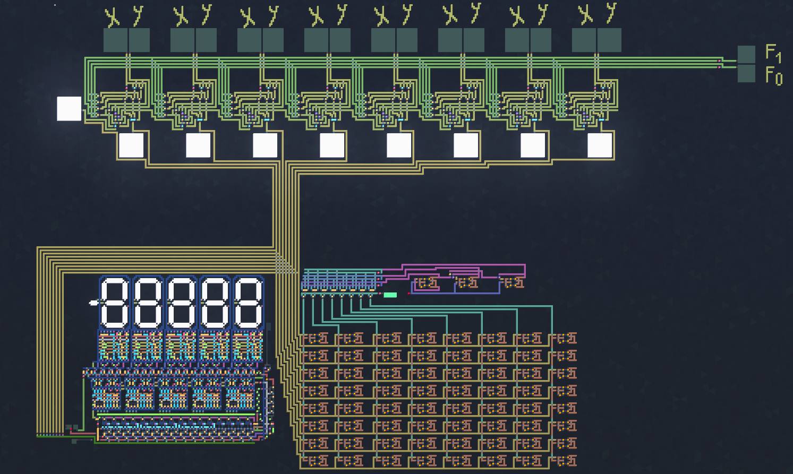
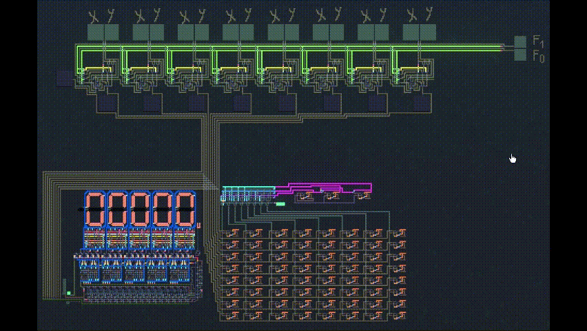

# 🖥️ 8-Bit CPU — Built From Logic Gates Up

> **A gate-level 8-bit digital computing system built from scratch to understand what actually happens beneath software.**

This project started with individual logic gates and gradually grew into an integrated 8-bit system containing a custom ALU, decoder-controlled operation selection, ripple-carry arithmetic, flip-flop-based RAM, timer-driven memory selection, and a continuously updated output stage.

Instead of dropping in prebuilt CPU, ALU, or RAM blocks, the project deliberately exposes the hardware underneath them: **Boolean logic, control signals, carry propagation, state, timing, memory selection, and data routing.**

---

## 🚀 Project at a Glance

| ⚙️ Category | 🔍 Current Implementation | ✅ Status |
|---|---|---|
| **Data Width** | 8-bit | ✅ Working |
| **Binary Inputs** | Two independent 8-bit inputs | ✅ Working |
| **ALU** | 8 × custom 1-bit ALU slices | ✅ Working |
| **Operations** | AND · OR · NOT · ADD | ✅ Tested |
| **Operation Control** | 2-bit opcode → 2-to-4 decoder | ✅ Working |
| **Arithmetic** | Full adders + LSB→MSB ripple carry | ✅ Working |
| **Memory** | 8 × 8 D-type flip-flop matrix | ✅ Working |
| **Memory Capacity** | 64 bits / 8 bytes | ✅ Working |
| **Memory Selection** | Timer-driven selection logic | 🟡 Functional / redesign planned |
| **Output** | Decoder-routed continuously updated display | ✅ Working |
| **ALU Verification** | 16 dedicated test cases | ✅ 16 / 16 passed |
| **Project State** | Integrated mainboard | 🔧 Active development |

---

# 📸 Current Build




### 🔎 What you are looking at

The latest build combines the major subsystems into one circuit: the binary inputs, operation-selection logic, eight ALU slices, RAM matrix, timer/selection circuitry, output decoder, and display path.

This image is intentionally placed near the top of the README so a visitor can understand the scale of the project before reading the gate-level details.

---

# 🎬 Live Demo — ADD in Action




### ➕ Demonstration: `1 + 1`

| Signal | Binary | Decimal / Meaning |
|---|---:|---|
| **Input A** | `00000001` | 1 |
| **Input B** | `00000001` | 1 |
| **Operation Code** | `11` | ADD |
| **ALU Result** | `00000010` | 2 |
| **Expected Result** | `00000010` | ✅ Correct |

```text
                    00000001   (1)
                  + 00000001   (1)
                  ─────────────────
                    00000010   (2)
```

The interesting part is not the arithmetic itself. The GIF demonstrates a result being produced by the actual hardware path built in the project: control logic selects the ADD circuitry, the 1-bit slices cooperate through the ripple-carry chain, and the resulting 8-bit value continues into the memory/output architecture.

---

# 🧭 Complete System Data Flow

```text
╔══════════════════════╗                         ╔══════════════════════╗
║      INPUT A         ║                         ║       INPUT B        ║
║      A[7:0]          ║                         ║       B[7:0]         ║
╚══════════╤═══════════╝                         ╚══════════╤═══════════╝
           │                                                  │
           │              ╔══════════════════════╗            │
           │              ║   OPERATION CODE     ║            │
           │              ║       F1:F0          ║            │
           │              ╚══════════╤═══════════╝            │
           │                         │                        │
           │                         ▼                        │
           │              ╔══════════════════════╗            │
           │              ║  2 → 4 DECODER       ║            │
           │              ║ D0 D1 D2 D3          ║            │
           │              ╚══════════╤═══════════╝            │
           │                         │                        │
           └─────────────────────────┼────────────────────────┘
                                     ▼
                    ╔════════════════════════════════╗
                    ║          8-BIT ALU             ║
                    ║                                ║
                    ║  ┌──────┐  ┌──────┐           ║
                    ║  │Bit 0 │─►│Bit 1 │─► ...     ║
                    ║  └──────┘  └──────┘     │     ║
                    ║      LSB   RIPPLE CARRY  MSB   ║
                    ║                                ║
                    ║   AND · OR · NOT · ADD         ║
                    ╚═══════════════╤════════════════╝
                                    │
                                    │ F[7:0]
                                    ▼
                    ╔════════════════════════════════╗
                    ║        8 × 8 D-FF RAM          ║
                    ║                                ║
                    ║  64 bits total = 8 bytes      ║
                    ║  ALU result → storage cells   ║
                    ╚═══════════════╤════════════════╝
                                    │
                                    ▼
                    ╔════════════════════════════════╗
                    ║ TIMER / MEMORY SELECTION       ║
                    ║                                ║
                    ║ Cycles through stored data     ║
                    ╚═══════════════╤════════════════╝
                                    │
                                    ▼
                    ╔════════════════════════════════╗
                    ║       OUTPUT DECODER           ║
                    ╚═══════════════╤════════════════╝
                                    │
                                    ▼
                    ╔════════════════════════════════╗
                    ║           DISPLAY              ║
                    ║     Continuously Updated       ║
                    ╚════════════════════════════════╝
```

### 🔁 In one sentence

**Two 8-bit inputs → operation selection → 8-bit ALU → flip-flop RAM → timer-driven selection → output decoder → display.**

---

# 🏗️ System Architecture

The current system can be divided into several major subsystems:

1. Binary input stage
2. Operation-selection / decoder logic
3. Eight 1-bit ALU slices
4. Ripple-carry connection between ALU slices
5. Flip-flop-based RAM
6. Timer-driven RAM selection logic
7. Output decoder
8. Display/output stage

A simplified representation of the current architecture is:

```text
                    ┌─────────────────────┐
Input A [7:0] ─────►│                     │
                    │      8-Bit ALU      │─────► ALU Result [7:0]
Input B [7:0] ─────►│                     │                │
                    └──────────▲──────────┘                │
                               │                           ▼
                        Operation Code              ┌──────────────┐
                             [1:0]                  │              │
                               │                    │     RAM      │
                               ▼                    │  8 × 8 D-FF  │
                       ┌──────────────┐             │              │
                       │    2-to-4    │             └──────┬───────┘
                       │   Decoder    │                    │
                       └──────────────┘                    ▼
                                                   Timer / Selection
                                                          │
                                                          ▼
                                                   Output Decoder
                                                          │
                                                          ▼
                                                       Display
```

This diagram is intentionally simplified. The actual circuit contains the individual gates, decoder lines, ALU slices, carry connections, flip-flops, clock/timing paths, and selection wiring required to implement these blocks.

---

# 🔄 Data Flow

The CPU operates around an 8-bit data path.

Two 8-bit binary values are supplied to the system:

```text
A7 A6 A5 A4 A3 A2 A1 A0
B7 B6 B5 B4 B3 B2 B1 B0
```

Each corresponding pair of bits is processed by one 1-bit ALU slice.

For example:

```text
A0 + B0 → ALU Slice 0
A1 + B1 → ALU Slice 1
A2 + B2 → ALU Slice 2
...
A7 + B7 → ALU Slice 7
```

All slices receive the same operation-selection signals.

This means that if the operation code selects AND, all eight slices perform AND simultaneously. If ADD is selected, the full-adder path is enabled and the carry chain connects the arithmetic behavior of the eight slices.

The resulting eight output bits form:

```text
F7 F6 F5 F4 F3 F2 F1 F0
```

This result is then passed into the memory stage.

---

# 🧠 ALU Design

The Arithmetic Logic Unit is the central processing component of the current architecture.

Instead of building the complete 8-bit ALU immediately, the design was developed hierarchically:

```text
Logic Gates
    ↓
Half Adder
    ↓
Full Adder
    ↓
Decoder
    ↓
1-Bit ALU
    ↓
8 × 1-Bit ALU Slices
    ↓
8-Bit ALU
```

This approach allowed each subsystem to be tested independently before being integrated into a larger circuit.

---

# 🧩 1-Bit ALU

The 1-bit ALU is the fundamental processing block of the system.

Each slice receives:

```text
X
Y
Cin
Operation Code
```

and produces:

```text
Result
Cout
```

The ALU contains four operation paths:

- AND
- OR
- NOT
- ADD

The selected operation is determined by a two-bit operation code.

| F1 | F0 | Decoder Line | Selected Path | Input Usage | Carry Relevant? | 8-Bit Example |
|---:|---:|---|---|---|---|---|
| 0 | 0 | `D0` | **AND** | A AND B | No | `F0 AND 0F → 00` |
| 0 | 1 | `D1` | **OR** | A OR B | No | `F0 OR 0F → FF` |
| 1 | 0 | `D2` | **NOT** | NOT A | No | `NOT A5 → 5A` |
| 1 | 1 | `D3` | **ADD** | A + B + Cin | **Yes** | `0F + 01 → 10` |

This gives four possible operations from two control bits.

---

# 🎛️ Operation Decoder

A 2-to-4 decoder converts the two operation bits into four one-hot control lines.

For control inputs `F1` and `F0`:

```text
F1 F0
0  0  → D0
0  1  → D1
1  0  → D2
1  1  → D3
```

The corresponding operations are:

```text
D0 → AND
D1 → OR
D2 → NOT
D3 → ADD
```

Conceptually, the decoder outputs can be represented as:

```text
D0 = NOT(F1) AND NOT(F0)
D1 = NOT(F1) AND F0
D2 = F1 AND NOT(F0)
D3 = F1 AND F0
```

Because the decoder is one-hot, only one of these outputs should be active for a valid two-bit input combination.

This provides a clean way to select exactly one ALU operation.

---

# 🔀 ALU Output Selection

Each operation is calculated through its own logic path.

The decoder determines which result reaches the final output.

Conceptually:

```text
Result =
    (D0 AND AND_out)
 OR (D1 AND OR_out)
 OR (D2 AND NOT_out)
 OR (D3 AND ADD_out)
```

This selection network was an important part of the debugging process.

During development, incorrect decoder-line connections caused operations to appear under the wrong operation codes. The D0 and D1 routing was traced and corrected so that the final mapping became:

```text
00 → AND
01 → OR
10 → NOT
11 → ADD
```

---

# 🔹 AND Operation

The AND path performs a bitwise AND between corresponding input bits.

For one ALU slice:

```text
AND_out = X AND Y
```

Example:

```text
X = 1
Y = 1

AND_out = 1
```

For the complete 8-bit ALU:

```text
11110000
AND
00001111
────────
00000000
```

Each bit is evaluated independently.

---

# 🔸 OR Operation

The OR path performs a bitwise OR operation.

For one slice:

```text
OR_out = X OR Y
```

Example:

```text
X = 1
Y = 0

OR_out = 1
```

Across eight bits:

```text
11110000
OR
00001111
────────
11111111
```

---

# 🔁 NOT Operation

The NOT path inverts the selected input bit.

Conceptually:

```text
NOT_out = NOT(X)
```

Example:

```text
X = 0
NOT_out = 1
```

For an 8-bit value:

```text
Input:
10100101

Output:
01011010
```

or in hexadecimal:

```text
A5 → 5A
```

---

# ➕ Full Adder

The arithmetic path uses a full adder.

A full adder receives three inputs:

```text
X
Y
Cin
```

and generates two outputs:

```text
Sum
Cout
```

The full adder was constructed from two half adders and an OR gate rather than using a prebuilt arithmetic block.

Conceptually:

```text
Half Adder 1:
X + Y → S1, C1

Half Adder 2:
S1 + Cin → Sum, C2

Final Carry:
Cout = C1 OR C2
```

The Boolean relationships are equivalent to:

```text
Sum = X XOR Y XOR Cin

Cout = (X AND Y) OR (Cin AND (X XOR Y))
```

Building the adder from smaller components made the carry behavior visible and testable before the design was scaled to eight bits.

---

# 📈 From 1 Bit to 8 Bits

After the 1-bit ALU was verified, it was duplicated eight times.

Each slice processes one bit position:

```text
Slice 0 → bit 0
Slice 1 → bit 1
Slice 2 → bit 2
Slice 3 → bit 3
Slice 4 → bit 4
Slice 5 → bit 5
Slice 6 → bit 6
Slice 7 → bit 7
```

All slices share the same operation code.

Therefore:

```text
F1 F0 = 00
```

causes all eight slices to execute AND, while:

```text
F1 F0 = 11
```

selects the arithmetic path across all eight slices.


---

# 🌊 Ripple-Carry Architecture

Addition requires communication between adjacent ALU slices.

The carry-out of the least significant stage is connected to the carry-in of the next stage:

```text
Bit 0 Cout → Bit 1 Cin
Bit 1 Cout → Bit 2 Cin
Bit 2 Cout → Bit 3 Cin
...
Bit 6 Cout → Bit 7 Cin
```

The full chain is:

```text
Cin
 │
 ▼
Bit 0 ─Cout─► Bit 1 ─Cout─► Bit 2 ─Cout─► ... ─Cout─► Bit 7
 LSB                                                        MSB
```

This is a ripple-carry adder.

The name comes from the fact that a carry generated at a low-order bit may need to propagate through several higher-order stages before the final result stabilizes.

---

# 🐛 Carry Propagation Debugging

One of the most important bugs encountered during development involved the direction of the carry chain.

The individual ALU slices worked correctly, but multi-bit arithmetic produced incorrect results.

This indicated that the problem was not necessarily inside the full-adder logic itself.

Tracing the connections showed that carry propagation had been wired in the wrong direction.

The incorrect direction was replaced with:

```text
LSB → MSB
```

After rewiring, carry propagation could be visually observed moving through the stages.

A useful verification case was:

```text
00001111
+
00000001
────────
00010000
```

The lower four `1` bits each generate a carry into the next stage until the carry reaches the fifth bit.

This provided a practical demonstration of ripple-carry behavior rather than only verifying a final output value.

---

# 🚧 Carry-Out Isolation

Another issue appeared after arithmetic was working.

Carry-out signals could remain visible while logic operations such as AND or OR were selected.

This was undesirable because carry is meaningful for the ADD operation but should not affect the visible behavior of independent logic operations.

The solution was to gate the carry output with the ADD decoder line.

Conceptually:

```text
Visible_Cout = Cout AND D3
```

Since:

```text
D3 = 1
```

only when:

```text
F1 F0 = 11
```

carry-out becomes externally active only during ADD.

This separated arithmetic state from logic-operation output.

---

# 💾 RAM Architecture

After completing the ALU, the next major stage was storing its output.

The memory system is built from an 8 × 8 matrix of D-type flip-flops.

```text
8 rows × 8 columns = 64 bits
```

Since:

```text
8 bits = 1 byte
```

the matrix represents:

```text
64 bits = 8 bytes
```

of flip-flop-based storage.


The goal was not to use an abstract memory component, but to construct storage from state-holding digital logic.

---

# 🧱 RAM Matrix

Conceptually, the memory can be viewed as:

```text
          Bit 7 Bit 6 Bit 5 Bit 4 Bit 3 Bit 2 Bit 1 Bit 0

Slot 0      Q     Q     Q     Q     Q     Q     Q     Q
Slot 1      Q     Q     Q     Q     Q     Q     Q     Q
Slot 2      Q     Q     Q     Q     Q     Q     Q     Q
Slot 3      Q     Q     Q     Q     Q     Q     Q     Q
Slot 4      Q     Q     Q     Q     Q     Q     Q     Q
Slot 5      Q     Q     Q     Q     Q     Q     Q     Q
Slot 6      Q     Q     Q     Q     Q     Q     Q     Q
Slot 7      Q     Q     Q     Q     Q     Q     Q     Q
```

Each group of eight flip-flops can hold one 8-bit value.

The ALU's eight result lines provide the data that can be stored in the memory matrix.

---

# 🔗 ALU-to-RAM Data Path

The eight ALU outputs form the memory input data:

```text
F7 F6 F5 F4 F3 F2 F1 F0
```

These lines are connected into the flip-flop storage stage.

Conceptually:

```text
ALU F0 → RAM bit 0 input
ALU F1 → RAM bit 1 input
ALU F2 → RAM bit 2 input
...
ALU F7 → RAM bit 7 input
```

This creates a direct processing-to-storage path:

```text
Input
  ↓
ALU
  ↓
8-bit Result
  ↓
Flip-Flop Matrix
```

This was an important transition in the project because the system moved from being purely combinational to containing persistent state.

---

# 💡 D-Type Flip-Flop Development

The RAM depends on stable flip-flop behavior.

The initial flip-flop implementation exposed a problem: under some conditions, the internal latch could reach an invalid or unstable state.

The flip-flop logic was therefore redesigned using NAND-based gating.

The input stage follows:

```text
S = NAND(D, CK)
R = NAND(NOT(D), CK)
```

The complementary data paths help ensure that the internal set and reset behavior does not request contradictory states during normal operation.

The final outputs maintain:

```text
Q
NOT Q
```

as complementary signals.


This debugging step was significant because a RAM matrix can only be reliable if a single memory cell behaves correctly first.

The same incremental principle used for the ALU therefore also applied to memory:

```text
Single Flip-Flop
      ↓
Verified Storage Cell
      ↓
Repeated Cells
      ↓
8 × 8 RAM Matrix
```

---

# 🎯 Memory Selection Logic

A memory matrix requires more than storage cells.

The circuit must also determine which group of flip-flops is currently selected.

Decoder logic provides a way to transform a compact binary selection value into individual one-hot lines.

For a 3-to-8 decoder:

```text
A2 A1 A0 → one of eight outputs
```

Conceptually:

```text
000 → Y0
001 → Y1
010 → Y2
011 → Y3
100 → Y4
101 → Y5
110 → Y6
111 → Y7
```

Only one output should be active at a time.

This makes decoder logic useful for selecting one location from eight possible memory locations.

---

# ⏱️ Clock and Write Gating

The RAM design also explored controlled writing using selection, write-enable, and clock signals.

The general idea is that a storage location should change only when:

1. that location is selected,
2. writing is enabled,
3. a valid clock event occurs.

Conceptually, a gated write signal can be represented as:

```text
WriteClock[n] = Select[n] AND WE AND CLK
```

where:

```text
Select[n] = decoder output for memory location n
WE        = global write-enable
CLK       = write clock
```

This means an unselected memory location should not receive the active write event.

This section represents the write-control logic explored during development. The current integrated RAM/output-selection design is still planned for further optimization, so the final memory architecture should not be treated as a finished conventional CPU memory controller.

---

# ⏲️ Timer-Driven RAM Selection

The current integrated design includes a continuously running timer associated with the RAM selection/output stage.

The timer advances the selection logic so that the memory columns/locations are cycled automatically rather than requiring every selection to be changed manually.

At a high level:

```text
Timer
  │
  ▼
Selection State
  │
  ▼
RAM Location / Column Selection
  │
  ▼
Stored Data
  │
  ▼
Output Decoder
  │
  ▼
Display
```

This allows stored information to be routed toward the output stage as the selection state changes.

The mechanism is functional in the current circuit, but this is also the part of the project most clearly marked for redesign.

The next version should aim to make the relationship between:

```text
memory location
selection
timing
write control
read/output routing
```

more explicit and easier to reason about.

---

# 🖥️ Output Stage

After data has been stored in RAM, selected stored data is routed toward another decoder/output stage.

The output stage continually updates based on the currently selected memory information.

Conceptually:

```text
RAM
 │
 ▼
Selection Logic
 │
 ▼
Output Decoder
 │
 ▼
Display
```

This provides visual feedback from the storage portion of the system and makes the internal state of the circuit observable during testing.

---

# 🧪 Verification Strategy

The project was tested incrementally.

Instead of connecting every subsystem first and debugging the complete architecture afterward, smaller components were verified before integration.

The general testing strategy was:

```text
Test gates
   ↓
Test half adder
   ↓
Test full adder
   ↓
Test decoder
   ↓
Test 1-bit ALU
   ↓
Test ALU selection
   ↓
Scale to 8 bits
   ↓
Test ripple carry
   ↓
Test flip-flop
   ↓
Build RAM
   ↓
Connect ALU to RAM
   ↓
Test selection/output behavior
```

This helped isolate failures to specific subsystems.

---

# ✅ 8-Bit ALU Verification

The completed ALU was tested with sixteen cases covering AND, OR, NOT, ordinary addition, carry propagation, and 8-bit overflow.

## AND Tests

| Test | Input A | Input B | Expected Result | Carry |
|-----:|---------|---------|-----------------|------:|
| 1 | 00 | 00 | 00 | 0 |
| 2 | F0 | 0F | 00 | 0 |
| 3 | FF | FF | FF | 0 |

## OR Tests

| Test | Input A | Input B | Expected Result | Carry |
|-----:|---------|---------|-----------------|------:|
| 4 | F0 | 0F | FF | 0 |
| 5 | A5 | 5A | FF | 0 |

## NOT Tests

| Test | Input A | Expected Result | Carry |
|-----:|---------|-----------------|------:|
| 6 | 00 | FF | 0 |
| 7 | FF | 00 | 0 |
| 8 | A5 | 5A | 0 |

## ADD Tests

| Test | Input A | Input B | Expected Result | Carry |
|-----:|---------|---------|-----------------|------:|
| 9 | 00 | 00 | 00 | 0 |
| 10 | 01 | 00 | 01 | 0 |
| 11 | 0F | 01 | 10 | 0 |
| 12 | FF | 01 | 00 | 1 |
| 13 | 7F | 01 | 80 | 0 |
| 14 | 80 | 80 | 00 | 1 |
| 15 | AA | 55 | FF | 0 |
| 16 | 55 | 55 | AA | 0 |

All sixteen ALU verification cases passed.

---

# 🔬 Why These Tests Matter

The tests were selected to exercise different failure modes.

For example:

```text
00 + 00 = 00
```

checks the simplest arithmetic case.

```text
01 + 00 = 01
```

checks that an isolated low bit passes through correctly.

```text
0F + 01 = 10
```

forces a carry to propagate through several consecutive bit positions.

```text
FF + 01 = 00 with Cout = 1
```

tests full 8-bit overflow.

```text
7F + 01 = 80
```

tests propagation into the most significant bit without an external carry.

```text
80 + 80 = 00 with Cout = 1
```

tests a carry generated directly from the most significant stage.

The alternating-bit cases:

```text
AA + 55 = FF
55 + 55 = AA
```

help verify that multiple independent bit positions and carry relationships behave correctly.

---

# 🛠️ Major Engineering Challenges

## 1. Carry Chain Connected in the Wrong Direction

### Symptom

Individual ALU slices behaved correctly, but multi-bit addition failed.

### Diagnosis

Since each 1-bit adder passed isolated tests, the problem was likely in the connections between slices rather than inside the adder itself.

### Cause

Carry propagation was connected in the wrong direction.

### Fix

The carry chain was rewired:

```text
LSB → MSB
```

### Result

Multi-bit arithmetic began working correctly and carry propagation could be observed across adjacent stages.

---

## 2. Incorrect ALU Operation Routing

### Symptom

Some operation codes produced results from the wrong logic path.

### Diagnosis

The individual AND/OR/etc. circuits worked independently, indicating that the issue was in selection rather than computation.

### Cause

Decoder/output-selection lines were mixed.

### Fix

The decoder connections were traced and corrected until the mapping matched:

```text
00 → AND
01 → OR
10 → NOT
11 → ADD
```

### Lesson

Correct computation is not enough. Control signals and data routing are equally important in a digital system.

---

## 3. Incorrect Output Combiner

During development, an XOR-style combination was used where the selected operation outputs needed to be combined using OR logic.

Because decoder selection is one-hot, only one gated operation result should be active.

Therefore the correct structure is:

```text
Selected_AND
OR Selected_OR
OR Selected_NOT
OR Selected_ADD
```

Replacing the incorrect combiner with OR logic corrected the selection behavior.

---

## 4. Carry Leakage During Logic Operations

### Symptom

Carry-out could remain visible when AND, OR, or NOT was selected.

### Cause

The raw arithmetic carry signal was not isolated from non-arithmetic modes.

### Fix

Carry-out was gated with the ADD decoder line:

```text
Visible_Cout = Cout AND D3
```

### Result

Carry became meaningful only during ADD mode.

---

## 5. Flip-Flop Invalid State

### Symptom

The original storage-cell design could produce invalid internal latch behavior.

### Cause

The set/reset control relationship did not reliably prevent conflicting states.

### Fix

The input logic was redesigned around NAND gating:

```text
S = NAND(D, CK)
R = NAND(NOT(D), CK)
```

### Result

The memory cell behaved more reliably and maintained complementary `Q` and `NOT Q` outputs.

---

## 6. Scaling a Working Component

A circuit that works for one bit does not automatically become a correct 8-bit system simply by copying it eight times.

Scaling introduced new problems:

- carry direction,
- shared control lines,
- repeated wiring,
- decoder distribution,
- signal routing,
- output organization,
- memory integration.

This became one of the main lessons of the project: integration problems can be different from component-level problems.

---

# 🗺️ Development Timeline

The project evolved through multiple stages.

## Stage 1 — Basic Digital Logic

The first step was working with fundamental gates and understanding their truth-table behavior.

Core components included:

```text
AND
OR
NOT
XOR
NAND
```

These became the building blocks for every later subsystem.

---

## Stage 2 — Half Adder

A half adder was created to add two binary inputs.

It produces:

```text
Sum
Carry
```

This established the foundation for binary arithmetic.

---

## Stage 3 — Full Adder

The half-adder design was expanded into a full adder capable of accepting an incoming carry.

This made multi-bit arithmetic possible.

---

## Stage 4 — 2-to-4 Decoder

A decoder was constructed to translate two control bits into four one-hot operation-selection lines.

This became the control mechanism for the ALU.

---

## Stage 5 — 1-Bit ALU

The logic operations, arithmetic path, decoder, and output-selection network were integrated into a single reusable 1-bit processing slice.


---

## Stage 6 — 8-Bit ALU

Eight 1-bit ALU slices were connected in parallel.

The operation code was shared across all slices.

The arithmetic carry chain was connected from LSB to MSB.


---

## Stage 7 — ALU Debugging and Verification

The 8-bit design was tested using sixteen cases.

Problems discovered during this stage included:

- reversed carry propagation,
- incorrect decoder mapping,
- incorrect output combination,
- carry leakage.

Each issue was isolated and corrected.

---

## Stage 8 — Flip-Flop Storage

A D-type storage element was developed and debugged.

The flip-flop design was refined to eliminate invalid states.


---

## Stage 9 — 64-Bit RAM Matrix

The storage cell was replicated into an 8 × 8 matrix.

This created 64 bits, or eight bytes, of storage.


---

## Stage 10 — ALU-to-RAM Integration

The eight ALU result lines were connected to the RAM input stage.

This created a direct path from computation to persistent state.

---

## Stage 11 — Automatic Memory Selection

Timing and decoder logic were added so that the memory selection/output process could advance automatically.

This replaced part of the earlier manual interaction with timer-driven behavior.

---

## Stage 12 — Integrated Mainboard

The processing, storage, timing, decoder, and output subsystems were integrated into the main CPU circuit.

The complete circuit is stored in:

```text
8bit_CPU_Mainboard.vcb
```

---

# 🎓 What I Learned

This project provided a much deeper understanding of digital systems than using a prebuilt ALU, register, or memory component would have provided.

Some of the most important lessons were:

### Computation is mostly controlled data movement

An ALU does not simply "know" which operation to execute. Multiple possible operation paths can exist simultaneously, while control logic determines which result is allowed to continue through the system.

### Multi-bit arithmetic is built from repeated small components

An 8-bit adder can be understood as eight 1-bit adders connected through carry signals.

### State changes the nature of a circuit

The ALU is primarily combinational: its output depends on its current inputs.

Adding flip-flops introduces state. The system can now retain information after the original combinational calculation has occurred.

### Timing matters

Once stateful components are introduced, the question is no longer only "what value is on this wire?"

It also becomes:

```text
When should this value be stored?
Which location should receive it?
When should the stored value be read or displayed?
```

### Control logic is as important as arithmetic logic

Several major bugs were not caused by incorrect arithmetic. They came from selection signals, decoder wiring, carry isolation, and routing.

### Integration creates new failure modes

A component can be correct by itself and still fail after being connected to other correct components.

Testing at multiple levels is therefore essential:

```text
component
→ subsystem
→ integrated system
```

---

# ⚖️ Design Decisions

## Why Build the ALU From 1-Bit Slices?

Using repeated 1-bit slices makes the architecture modular.

Each slice can be understood and tested independently.

It also exposes the relationship between bit width and hardware replication:

```text
1-bit ALU × 8 = 8-bit ALU
```

The exception is arithmetic carry, which requires communication between adjacent slices.

---

## Why Use a Decoder?

A decoder provides an explicit hardware representation of operation selection.

Rather than hiding control inside a prebuilt multiplexer or ALU block, the circuit shows how a binary operation code becomes individual control lines.

---

## Why Build RAM From Flip-Flops?

Using a prebuilt RAM module would make the overall circuit smaller, but it would hide the storage mechanism.

Constructing RAM from flip-flops makes several concepts visible:

- state,
- clocking,
- write control,
- location selection,
- stored outputs,
- memory organization.

For this project, understanding those mechanisms was more important than minimizing circuit size.

---


# 🧰 Subsystem Breakdown

| Subsystem | Inputs | Control | Output | Main Building Blocks | Purpose | Current State |
|---|---|---|---|---|---|---|
| **Input Stage** | Two 8-bit binary values | Manual input state | A[7:0], B[7:0] | Binary switches / lines | Supplies operands | ✅ Working |
| **Operation Decoder** | F1, F0 | 2-bit opcode | D0–D3 one-hot | NOT + AND logic | Selects ALU function | ✅ Working |
| **1-Bit ALU Slice** | X, Y, Cin | D0–D3 | Result, Cout | AND, OR, NOT, full adder, gates | Processes one bit | ✅ Working |
| **8-Bit ALU** | A[7:0], B[7:0] | Shared opcode | F[7:0], Cout | 8 ALU slices | Processes full byte | ✅ Working |
| **Carry Chain** | Cout from lower bit | ADD mode | Cin to next bit | Inter-slice wiring | Multi-bit arithmetic | ✅ Fixed / tested |
| **RAM Cell** | D, clock | Clock state | Q, NOT Q | NAND-based D-FF logic | Stores one bit | ✅ Working |
| **RAM Matrix** | F[7:0] | Selection / write logic | Stored 8-bit values | 8 × 8 flip-flops | Stores ALU results | ✅ Working |
| **Timer Logic** | Clock/timing source | Continuous timing | Selection progression | Timing circuit | Advances memory selection | 🟡 Functional |
| **Output Decoder** | Selected RAM data | Selection state | Routed value | Decoder/routing logic | Sends data to display | ✅ Working |
| **Display Stage** | Routed output | Current selection | Visible value | Output indicators | Makes state observable | ✅ Working |

---

# ⚠️ Current Limitations

The current system is functional, but it should not be confused with a complete general-purpose CPU architecture.

In particular, the current project does not yet claim a conventional instruction-fetch/decode/execute pipeline or a completed general-purpose instruction set.

The two-bit operation code currently selects ALU behavior directly.

The RAM selection/output architecture also requires further refinement.

Current limitations include:

- RAM addressing/selection can be simplified.
- Timing logic can be organized more clearly.
- The read and write paths can be separated more explicitly.
- The current design contains more wiring than an optimized implementation would require.
- The control architecture can be expanded substantially.
- Additional state/register structures could be introduced in future versions.
- A future instruction-driven architecture would require additional control and sequencing logic.

Documenting these limitations is intentional. The project is an evolving hardware-design exercise rather than a claim that the current circuit reproduces a modern commercial processor.

---

# 🚀 Future Work

## RAM Optimization — Highest Priority

The next major revision will focus on RAM.

Goals include:

- simplify memory selection,
- make addressing behavior easier to understand,
- reduce unnecessary gates and wiring,
- separate read and write behavior more clearly,
- improve clock/write-enable organization,
- make stored locations easier to inspect,
- improve the connection between RAM and the output path.

The existing RAM works, so the goal is not simply to replace it. The goal is to redesign it after understanding what parts of the first implementation can be improved.

---

## Improved Architecture Diagram

A final block diagram will document the exact integrated system.

The diagram should show:

```text
Inputs
Operation Control
Decoder
ALU
Carry Chain
RAM
Timer / Selection Logic
Output Decoder
Display
```

This will make it possible to understand the project at a high level before examining the gate-level circuit.

---

## Additional ALU Operations

Future ALU revisions could explore operations such as:

```text
XOR
SUB
Increment
Decrement
Shift Left
Shift Right
```

These would require changes to the operation-selection/control architecture because the current two-bit operation code provides four combinations.

---

## More Structured Control Logic

A future version could move beyond direct ALU operation selection toward a more complete control system.

Possible additions include:

- instruction register,
- expanded opcode decoder,
- register file,
- program counter,
- instruction memory,
- controlled data buses,
- multi-step execution sequencing.

These are future goals, not components claimed to exist in the current design.

---

## Toward an Instruction-Driven CPU

A later revision could implement a small instruction set.

For example, a future architecture might eventually support instructions conceptually similar to:

```text
LOAD
STORE
ADD
AND
OR
NOT
JUMP
```

Doing this correctly would require a control unit capable of coordinating memory, registers, ALU selection, and timing across multiple execution stages.

---

# Possible Future Execution Cycle

A more complete future CPU could follow a sequence such as:

```text
FETCH
  ↓
DECODE
  ↓
READ OPERANDS
  ↓
EXECUTE
  ↓
MEMORY ACCESS
  ↓
WRITE BACK
```

The current project provides some of the fundamental components needed to understand how such a system could eventually be constructed, but it does not claim to implement this complete cycle yet.

---

# 📁 Project Structure

Current repository structure:

```text
8bit_CPU/
│
├── 8bit_CPU_Mainboard.vcb
│
├── 8bit_ALU/
│   ├── 04_ALU_01.png
│   ├── 1-bit-ALU.png
│   ├── 1-bit_ALU.gif
│   ├── 1-bit_ALU.png
│   ├── 1-bit_Flip-Flop.png
│   ├── 64-bit_ram.png
│   ├── 8-bit-arithemtic-logic-unit.png
│   ├── 8-bit_ALU.png
│   ├── Flip-Flop.gif
│   ├── cpu-design-101-layers.png
│   ├── register_file.gif
│   ├── current-state.png        # newest full-system screenshot
│   └── current-state.gif         # new ADD-operation demo
│
└── README.md
```

`8bit_CPU_Mainboard.vcb` contains the integrated digital circuit.

The `8bit_ALU` directory contains development screenshots, diagrams, and GIF demonstrations used to document the project.

---

# 📊 Technical Summary

| Component | Implementation |
|-----------|----------------|
| Data width | 8 bits |
| ALU construction | 8 × 1-bit ALU slices |
| ALU operations | AND, OR, NOT, ADD |
| Operation control | 2-bit opcode |
| Operation selection | 2-to-4 decoder |
| Arithmetic | Ripple-carry full adders |
| Carry direction | LSB → MSB |
| Memory | 8 × 8 D-type flip-flop matrix |
| Memory capacity | 64 bits / 8 bytes |
| Memory input | 8-bit ALU result |
| Selection | Decoder/timer-driven logic |
| Output | Decoder/display stage |
| ALU verification | 16/16 test cases passed |
| Status | Functional, active development |

---

# 🚦 Project Status

**Functional — Active Development**

Currently implemented and tested:

- [x] Fundamental logic-gate circuits
- [x] Half-adder logic
- [x] Full-adder logic
- [x] 2-to-4 operation decoder
- [x] 1-bit ALU
- [x] Eight 1-bit ALU slices
- [x] 8-bit ALU
- [x] AND operation
- [x] OR operation
- [x] NOT operation
- [x] ADD operation
- [x] LSB-to-MSB ripple carry
- [x] Carry-out isolation during logic modes
- [x] D-type flip-flop storage
- [x] 8 × 8 flip-flop RAM
- [x] ALU-to-RAM connection
- [x] Timer-driven RAM selection behavior
- [x] Output routing/display
- [x] 16-case ALU verification suite

Planned:

- [ ] Add/update complete CPU operation GIF
- [ ] Optimize RAM architecture
- [ ] Simplify memory selection/addressing
- [ ] Improve read/write organization
- [ ] Create final polished CPU block diagram
- [ ] Improve control architecture
- [ ] Explore additional ALU operations
- [ ] Investigate register-based architecture
- [ ] Explore an instruction-driven CPU revision

---

# 🧾 Final Notes

This project is primarily an exercise in understanding computer architecture from the logic level upward.

The most valuable parts of the development process were not only the moments when the circuit worked, but the failures that required tracing signals through the architecture:

- a carry chain connected in the wrong direction,
- decoder lines selecting the wrong operations,
- an incorrect output combiner,
- carry leaking into logic modes,
- unstable flip-flop behavior,
- and the increasing complexity of memory selection as the system grew.

Each problem forced the design to be understood at a lower level instead of being solved by replacing the subsystem with a prebuilt component.

The current version demonstrates the path from binary inputs through custom arithmetic/logic hardware into custom flip-flop storage and an automatically selected output stage.

The next major goal is to revisit the RAM architecture, simplify it, and use what was learned from the first implementation to build a cleaner second version.
