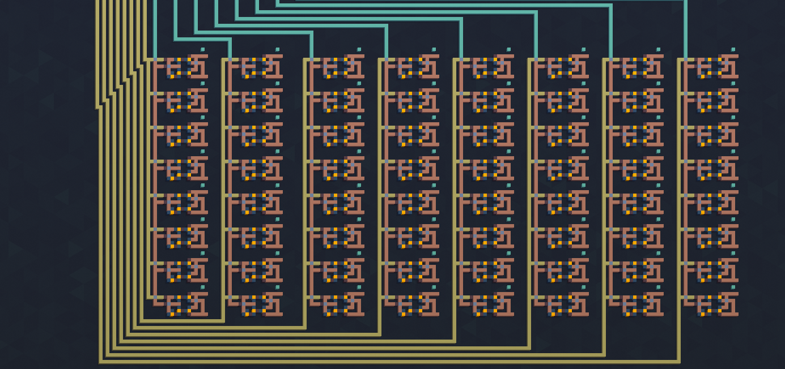
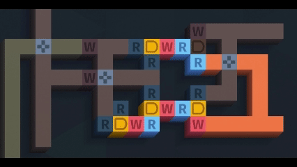
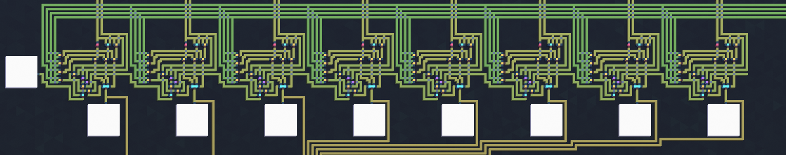
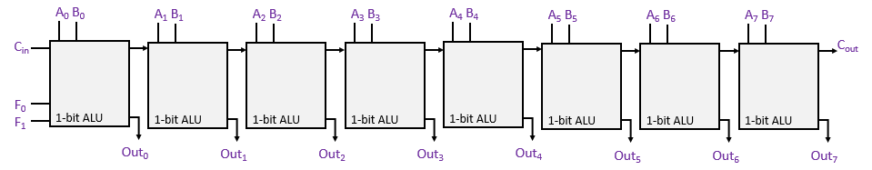
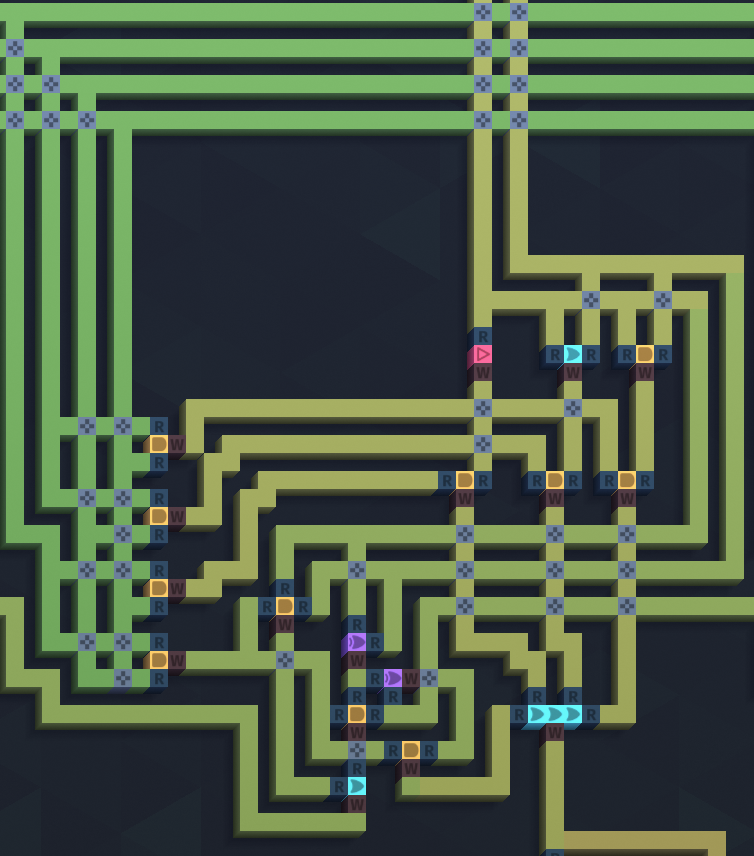
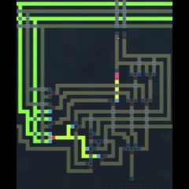
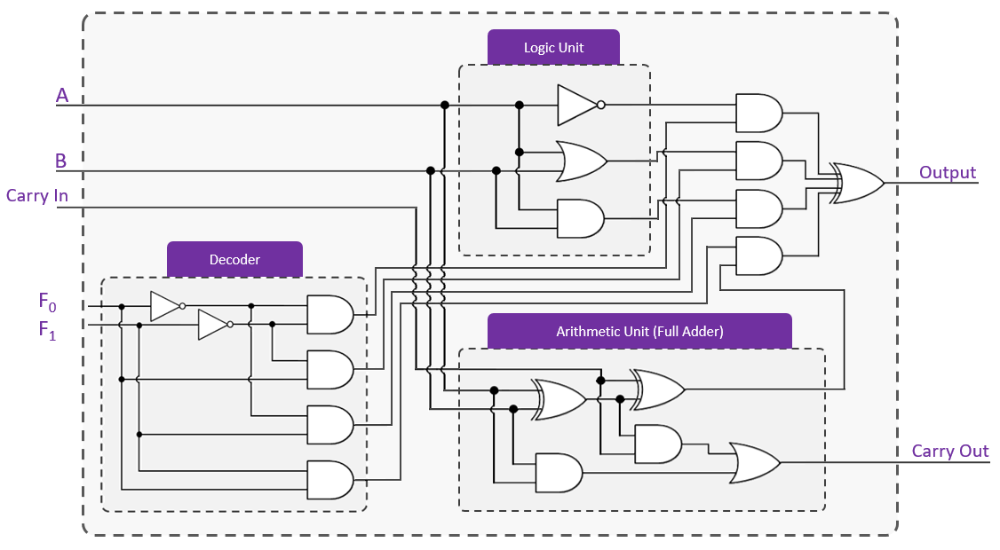

## 🧾 Daily Log
### RAM Automatic Addressing, Decoder Control, and Flip-Flop Logic Refinement

**Objective**  
Transition the RAM module from manual switch-based addressing to an automated, Program Counter–driven address system.  
The RAM now supports controlled writes from the ALU through coordinated decoder logic, clock gating, and write-enable control, more closely mirroring real CPU memory behavior.

---

### 🔧 Hardware Configuration Overview

**Core Components**

- 8×8 D-type flip-flop matrix (64 bits total → 8 bytes of RAM)
- 8 × 1-bit ALU slices (forming an 8-bit ALU)
- 3-to-8 binary decoder
- 3-bit Program Counter (PC)
- Global Write Enable (`WE`) switch
- Global Clock (`CLK`) push button
- AND-gate logic for gated column clocks

**Signal Groups**

| Signal        | Description                          | Direction                          |
|--------------|--------------------------------------|------------------------------------|
| `F0–F7`      | 8-bit ALU output                     | To flip-flop D inputs (bitlines)  |
| `A0–A2`      | Address bits from Program Counter    | To decoder inputs                  |
| `Y0–Y7`      | One-hot decoder outputs              | To gated column clock lines        |
| `WE`         | Global write enable                  | Manual control                     |
| `CLK`        | Global write clock pulse             | Manual control                     |
| `Q[row][col]`| Stored RAM bits                      | To future read bus / MUX stage     |



---

### ⚙️ Design Changes and Fixes

#### 1. Flip-Flop Logic Correction

Issue: Both `Q` and `/Q` were lit when `D = 1` and `CK = 1`, indicating an invalid SR-latch condition (`S = R = 0`).

Action:

- Reimplemented each D latch using NAND-based gating to ensure complementary outputs:

S = NAND(D, CK)
R = NAND(NOT(D), CK)
Result:
-  Q and /Q are always complementary (never both 1).
-  Eliminated illegal states and stabilized each memory cell.
2. ALU → RAM Data Path
   ---
-  Each ALU slice output (F0–F7) is wired vertically to a column of flip-flops (bitline).
-  All flip-flops in column n share Fn as their D input.
-  A cell only stores that bit when its corresponding row/column clock (from decoder + gating) is active.
This matches the standard memory model:
-  Bitlines carry data.
-  Wordlines / enable lines select which row actually latches.
3. Decoder Integration & Write Gating
   ---
-  A 3-to-8 decoder is used to select which memory row/column is active at a time.
-  Decoder inputs A0–A2 are now driven by the Program Counter instead of manual switches.
-  Each decoder output Y[n] is gated with WE and CLK:
Behavior:
-  Only one Y[n] is high for any address.
-  A write occurs only when:
-  -  That address is selected (Y[n] = 1)
-  -  WE = 1
-  -  A clock pulse (CLK) is applied
-  Prevents accidental multi-row writes and gives clean, deterministic behavior.
4. Program Counter Integration
   ---
-  Implemented a 3-bit binary Program Counter.
-  PC0, PC1, PC2 are wired directly into the decoder inputs A0–A2.
Effect:
-  Each clock cycle advances the active address:
-  000 → 001 → 010 → ... → 111
-  -  With WE enabled, sequential ALU results can be stored automatically into successive memory locations.
-  With WE disabled, the PC can still step through addresses without modifying RAM.
```text
            +------------------------+
ALU F0–F7 ->|   D0–D7 bitlines       |
            |   8×8 Flip-Flop RAM    |--> [Future] Read MUX / Output Bus
            +------------------------+

CLK, WE ---> AND with Y0–Y7 ---> ColumnClock[0–7]
                 ^
                 |
          3-to-8 Decoder <--- PC[2:0]
```



---
## 🧾 Daily Log
---
Scale the 1-bit ALU into an 8-bit ripple-carry ALU, verify logic and arithmetic correctness, and ensure proper carry propagation across all slices.
---

🔧 Development Process
Step	Task	Description / Result
- 	Built 8× 1-bit ALU slices	Duplicated the verified 1-bit ALU circuit into eight identical slices. Each slice contains its own full adder, logic gates (AND, OR, NOT), and multiplexer for result selection.
- 	Shared decoder control	A single 2→4 decoder was connected to all slices, distributing the same opcode signals (F1, F0). This ensures that every bit performs the same operation simultaneously.
- 	Carry-chain configuration	Connected Cout → Cin sequentially from the least-significant bit (LSB) to the most-significant bit (MSB). The external carry-in was grounded (Cin₀ = 0), and the final carry-out was observed from the MSB slice.
- 	Direction test	Initially, carry propagated in the wrong direction (MSB → LSB). Rewired the chain to flow LSB → MSB. Verified correct bit ordering by observing “domino zero” ripple effect with Y = 11111111.
- 	Logic verification	Confirmed that logic operations ignore carry and produce consistent results across all bits.
- 	Arithmetic verification	Confirmed correct addition and carry-out generation across all 8 bits. Ripple timing and sum bits were validated.
- 	Final testing	Performed full test suite (AND, OR, NOT, ADD). All results matched the expected truth tables.  
 
  |  #  | Opcode (F1 F0) | Operation | X (A) | Y (B) | Cin | Expected Result | Cout | Pass |
| :-: | :------------: | :-------- | :---: | :---: | :-: | :-------------: | :--: | :--: |
|  1  |       00       | AND       |   00  |   00  |  0  |        00       |   0  |   ✅  |
|  2  |       00       | AND       |   F0  |   0F  |  0  |        00       |   0  |   ✅  |
|  3  |       00       | AND       |   FF  |   FF  |  0  |        FF       |   0  |   ✅  |
|  4  |       01       | OR        |   F0  |   0F  |  0  |        FF       |   0  |   ✅  |
|  5  |       01       | OR        |   A5  |   5A  |  0  |        FF       |   0  |   ✅  |
|  6  |       10       | NOT X     |   00  |   —   |  0  |        FF       |   0  |   ✅  |
|  7  |       10       | NOT X     |   FF  |   —   |  0  |        00       |   0  |   ✅  |
|  8  |       10       | NOT X     |   A5  |   —   |  0  |        5A       |   0  |   ✅  |
|  9  |       11       | ADD       |   00  |   00  |  0  |        00       |   0  |   ✅  |
|  10 |       11       | ADD       |   01  |   00  |  0  |        01       |   0  |   ✅  |
|  11 |       11       | ADD       |   0F  |   01  |  0  |        10       |   0  |   ✅  |
|  12 |       11       | ADD       |   FF  |   01  |  0  |        00       |   1  |   ✅  |
|  13 |       11       | ADD       |   7F  |   01  |  0  |        80       |   0  |   ✅  |
|  14 |       11       | ADD       |   80  |   80  |  0  |        00       |   1  |   ✅  |
|  15 |       11       | ADD       |   AA  |   55  |  0  |        FF       |   0  |   ✅  |
|  16 |       11       | ADD       |   55  |   55  |  0  |        AA       |   0  |   ✅  |





---
## 🧾 Daily Log
---
Rebuild the ALU from scratch after design issues in the previous version.
---
Progress Summary:
Designed and implemented a 1-bit full adder using two half adders and an OR gate.
Verified the adder against the full truth table all outputs matched perfectly.
Built a 2→4 decoder using F1 and F0 inputs with NOT and AND gates to generate operation select lines.
Connected the decoder outputs to enable logic and arithmetic units.  
Implemented the logic unit supporting:

00 → X AND Y  
01 → X OR Y  
10 → NOT X  
11 → ADD X and Y (+ Cin)  

Constructed and tested the full ALU with all 16 test cases (logic + arithmetic).

All tests passed 1-to-1 correct Result and Cout for every operation.

Outcome:
The ALU is fully functional and validated. Decoder, logic unit, and full adder all operate correctly together.  
   | Test # | F1F0 (Opcode) |  X  |  Y  | Cin | Expected Result | Cout | Status |
| :----: | :-----------: | :-: | :-: | :-: | :-------------- | :--: | :----: |
|    1   |       00      |  0  |  0  |  0  | 0               |   0  |    ✅   |
|    2   |       00      |  1  |  1  |  0  | 1               |   0  |    ✅   |
|    3   |       01      |  0  |  1  |  0  | 1               |   0  |    ✅   |
|    4   |       10      |  0  |  –  |  0  | 1               |   0  |    ✅   |
|    5   |       10      |  1  |  –  |  0  | 0               |   0  |    ✅   |
|    6   |       11      |  0  |  0  |  0  | 0               |   0  |    ✅   |
|    7   |       11      |  0  |  1  |  1  | 0               |   1  |    ✅   |
|    8   |       11      |  1  |  1  |  1  | 1               |   1  |    ✅   |

<p align="center">
  
  
</p>


---

## 🧾 Daily Log
---
8-bit CPU Mainboard / ALU Module Testing
---
🔧 Work Done Today
Verified the 2-to-4 decoder design and corrected wiring.
Each combination of F1 F0 ∈ {00, 01, 10, 11} activates exactly one output (D0–D3).
Confirmed one-hot behavior with LED probes.
Connected the decoder outputs to the logic unit and adder blocks.
Performed functional testing on the 1-bit ALU slice before chaining 8 bits.
Implemented output selection network:

(D0 · AND_out) + (D1 · OR_out) + (D2 · NOT_out) + (D3 · ADD_out)

Replaced incorrect XOR combiner with OR gate.
Traced and corrected multiple wiring mix-ups between decoder lines and logic functions.
Swapped D0/D1 enables to align 00 → AND, 01 → OR.
Discovered carry-out leakage from adder in logic modes → gated Cout with D3.
Refined the NOT path to use pure ¬B signal, independent of A or Cin.
Built and verified 8-bit version: A[7:0], B[7:0] buses, carry chain, shared F1 F0 control.

---

|  F1 |  F0 | Cin |  A  |  B  | Expected Output | Expected Cout | Notes               |
| :-: | :-: | :-: | :-: | :-: | :-------------: | :-----------: | :------------------ |
|  0  |  0  |  X  |  0  |  0  |        0        |       0       | AND mode            |
|  0  |  0  |  X  |  1  |  0  |        0        |       0       | AND                 |
|  0  |  0  |  X  |  0  |  1  |        0        |       0       | AND                 |
|  0  |  0  |  X  |  1  |  1  |        1        |       0       | AND                 |
|  0  |  1  |  X  |  0  |  0  |        0        |       0       | OR mode             |
|  0  |  1  |  X  |  1  |  0  |        1        |       0       | OR                  |
|  0  |  1  |  X  |  0  |  1  |        1        |       0       | OR                  |
|  0  |  1  |  X  |  1  |  1  |        1        |       0       | OR                  |
|  1  |  0  |  X  |  0  |  0  |        1        |       0       | NOT mode (¬B)       |
|  1  |  0  |  X  |  0  |  1  |        0        |       0       | NOT                 |
|  1  |  0  |  X  |  1  |  0  |        1        |       0       | NOT                 |
|  1  |  0  |  X  |  1  |  1  |        0        |       0       | NOT                 |
|  1  |  1  |  0  |  0  |  0  |        0        |       0       | ADD mode            |
|  1  |  1  |  0  |  0  |  1  |        1        |       0       | ADD                 |
|  1  |  1  |  0  |  1  |  0  |        1        |       0       | ADD                 |
|  1  |  1  |  0  |  1  |  1  |        0        |       1       | ADD                 |
|  1  |  1  |  1  |  0  |  0  |        1        |       0       | ADD+Cin=1 (0+0+1=1) |
|  1  |  1  |  1  |  0  |  1  |        0        |       1       | ADD+Cin=1           |
|  1  |  1  |  1  |  1  |  0  |        0        |       1       | ADD+Cin=1           |
|  1  |  1  |  1  |  1  |  1  |        1        |       1       | ADD+Cin=1           |

Errors at line;
4th output 1 cout 1.  
8th output 1 cout 1.  
9th output 0 cout 0.  
11th output 0 cout 0.  
12th output 0 cout 1.


